# ESP32 Trainer
Proyecto de Electrónica Aplicada 1 - **USAC**

 

 

# 📘 Temario del Proyecto

- 🔹 [Introducción](#-introducción)
- 🔹 [ESP32 Trainer](#-esp32-trainer)
- 🔹 [Materiales](#-materiales)
- 🔹 [Diseño PCB - KiCad](#-diseño-pcb---kicad)
- 🔹 [Proyectos Demostrativos](#-proyectos-demostrativos)
<!-- - 🎥 [Video de Funcionamiento](#video-de-funcionamiento) -->

---

## 🧩 Introducción

En el ámbito del diseño electrónico y el desarrollo de prototipos, existe una necesidad creciente de contar con herramientas integradas que simplifiquen el proceso de aprendizaje, experimentación y construcción de soluciones funcionales. Las placas de desarrollo convencionales suelen requerir múltiples módulos adicionales para realizar proyectos completos, lo que incrementa la complejidad, los costos y el tiempo de implementación.

Este proyecto propone el diseño y fabricación de una **placa entrenadora basada en el ESP32-WROOM-32**, orientada a estudiantes, makers y profesionales. Su objetivo es integrar en una sola plataforma los elementos esenciales para trabajar con entradas/salidas digitales y analógicas, comunicación serial, control de cargas de alto voltaje, y más.

Entre sus características destacan:

- 🔘 Botones, LEDs y potenciómetros integrados para pruebas rápidas.
- ⚡ Control de cargas de 110V/220V mediante relés.
- 🔌 Interfaces UART, I2C y SPI disponibles desde headers.
- 📦 Diseño compacto y profesional en PCB de doble capa.

Con esta solución, se busca facilitar el desarrollo de proyectos de electrónica y automatización, reduciendo la necesidad de hardware adicional y mejorando la experiencia de aprendizaje.

[🔙 Volver al Temario](#-temario-del-proyecto)

## 🔌 ESP32 Trainer
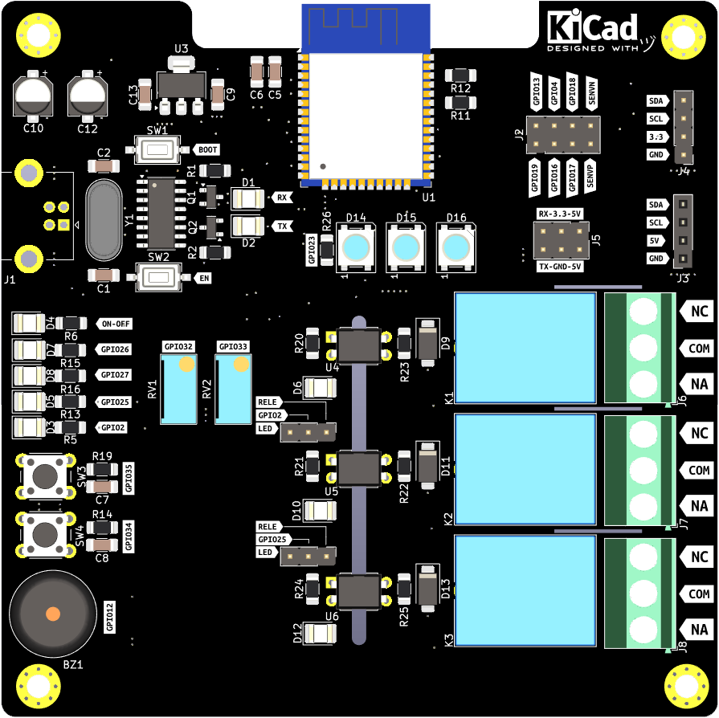

[🔙 Volver al Temario](#-temario-del-proyecto)

Descripción del ESP32 Trainer...

---

## 🧰 Materiales  

En esta sección se detallan todos los componentes electrónicos utilizados para el ensamblaje de la placa entrenadora basada en el ESP32-WROOM-32. La tabla incluye el identificador de cada componente, la cantidad necesaria, su valor o referencia, y el modelo de huella utilizado en el diseño PCB con KiCad.

<b>Lista de Materiales  - BOM</b>

| 🧾 Componente | 🔢 Cantidad | 💡 Valor       | 📐 Huella (KiCad)                                          |
|--------------|-------------|----------------|-------------------------------------------------------------|
| BZ1          | 1           | Buzzer         | Buzzer_12x9.5RM7.6                                          |
| C1, C2       | 2           | 22pF           | C_1206_3216Metric_Pad1.33x1.80mm_HandSolder                 |
| C10, C12     | 2           | 100uF          | CP_Elec_5x5.4                                               |
| C11, C13, C5, C6, C9 | 5   | 100nF          | C_1206_3216Metric_Pad1.33x1.80mm_HandSolder                 |
| C14–C16, C3–C4, C7–C8 | 7 | 0.1uF          | C_1206_3216Metric_Pad1.33x1.80mm_HandSolder                 |
| D1, D10, D7  | 3           | LED Verde      | LED_1210_3225Metric_Pad1.42x2.65mm_HandSolder               |
| D11, D13, D9 | 3           | SS24           | D_SMA                                                       |
| D12, D3, D8  | 3           | LED Azul       | LED_1210_3225Metric_Pad1.42x2.65mm_HandSolder               |
| D14–D16      | 3           | WS2812B        | LED_WS2812B_PLCC4_5.0x5.0mm_P3.2mm                          |
| D2           | 1           | LED Amarillo   | LED_1210_3225Metric_Pad1.42x2.65mm_HandSolder               |
| D4–D6        | 3           | LED Rojo       | LED_1210_3225Metric_Pad1.42x2.65mm_HandSolder               |
| J1           | 1           | USB B          | USB_B_Lumberg_2411_02_Horizontal                            |
| J10, J9      | 2           | —              | PinHeader_1x03_P2.54mm_Vertical                             |
| J2           | 1           | GPIO           | PinHeader_2x04_P2.54mm_Vertical                             |
| J3           | 1           | OLED           | PinSocket_1x04_P2.54mm_Vertical                             |
| J4           | 1           | —              | PinHeader_1x04_P2.54mm_Vertical                             |
| J5           | 1           | —              | PinHeader_2x03_P2.54mm_Vertical                             |
| J6–J8        | 3           | —              | TerminalBlock_Phoenix_MKDS-1,5-3-5.08_1x03_P5.08mm_Horizontal |
| K1–K3        | 3           | —              | Relay_SPDT_SANYOU_SRD_Series_Form_C                         |
| Q1–Q6        | 6           | MMBT3904       | SOT-23                                                      |
| R1, R2, R7, R9, R11, R12 | 6 | 10K         | R_1206_3216Metric_Pad1.30x1.75mm_HandSolder                 |
| R8, R10, R13–R16, R19–R21, R24 | 10 | 470   | R_1206_3216Metric_Pad1.30x1.75mm_HandSolder                 |
| R17, R22–R23, R25 | 4      | 2.2K           | R_1206_3216Metric_Pad1.30x1.75mm_HandSolder                 |
| R18          | 1           | 4.7K           | R_1206_3216Metric_Pad1.30x1.75mm_HandSolder                 |
| R26          | 1           | 220            | R_1206_3216Metric_Pad1.30x1.75mm_HandSolder                 |
| R3, R4       | 2           | 2K             | R_1206_3216Metric_Pad1.30x1.75mm_HandSolder                 |
| R5, R6       | 2           | 1K             | R_1206_3216Metric_Pad1.30x1.75mm_HandSolder                 |
| RV1, RV2     | 2           | 100K Pot       | Potentiometer_Bourns_3296W_Vertical                         |
| SW1, SW2     | 2           | —              | SW_Tactile_SPST_NO_Straight_CK_PTS636Sx25SMTRLFS            |
| SW3, SW4     | 2           | —              | SW_PUSH_6mm                                                 |
| U1           | 1           | ESP32-WROOM-32 | ESP32-WROOM-32                                              |
| U2           | 1           | CH340G         | SOIC-16_3.9x9.9mm_P1.27mm                                   |
| U3           | 1           | AMS1117-3.3    | SOT-223-3_TabPin2                                           |
| U4–U6        | 3           | PC817          | DIP-4_W7.62mm                                               |
| Y1           | 1           | 12MHz          | Crystal_HC49-4H_Vertical                                    |

[🔙 Volver al Temario](#-temario-del-proyecto)

## 🖨️ Diseño PCB - KiCad

 [KiCad](https://www.kicad.org/) se utilizó para el diseño de la placa entrenadora basada en el ESP32-WROOM-32, permitiendo crear el esquemático del circuito, asignar huellas adecuadas a los componentes y generar el diseño del PCB en múltiples capas. Gracias a sus herramientas de visualización y comprobación de reglas, fue posible optimizar el diseño para su posterior fabricación con alta precisión.

<b>📏 Esquemático KiCad</b>

Esquemático diseñado en Kicad, se puede visualizar de forma completa en este enlace [Esquemático](Schematic.pdf)

  
<strong>Power Supply</strong>

  

    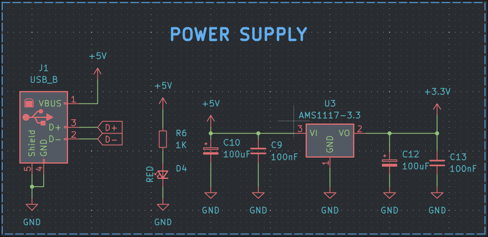
  

  
<strong>USB To TTL</strong>

  

    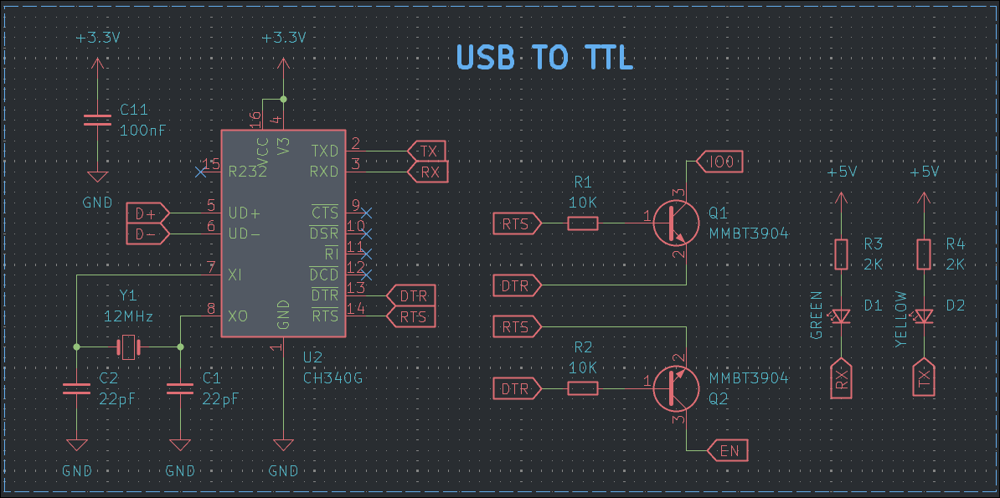
  

  
<strong>Boot Settings</strong>

  

    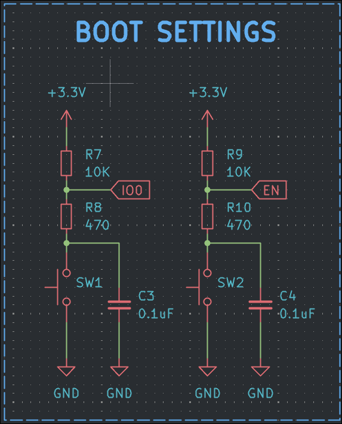
  

  
<strong>INPUT - OUTPUT Digital</strong>

  

    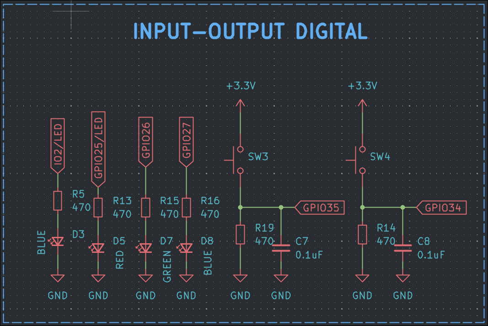
  

  
<strong>ESP32-WROOM</strong>

  

    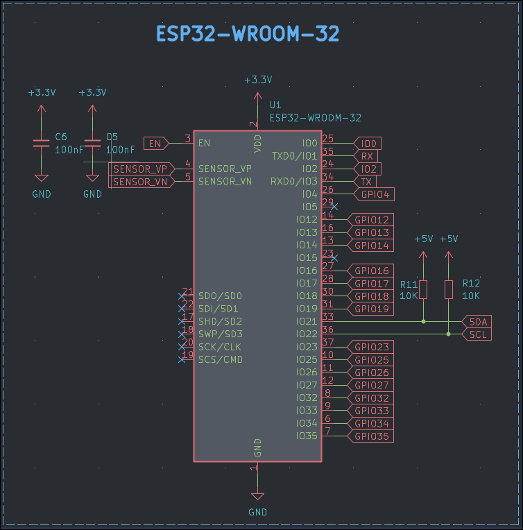
  

  
<strong>Analog INPUT</strong>

  

    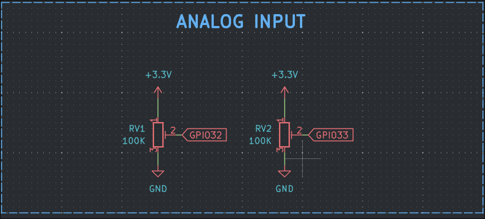
  

  
<strong>LED WS2812B</strong>

  

    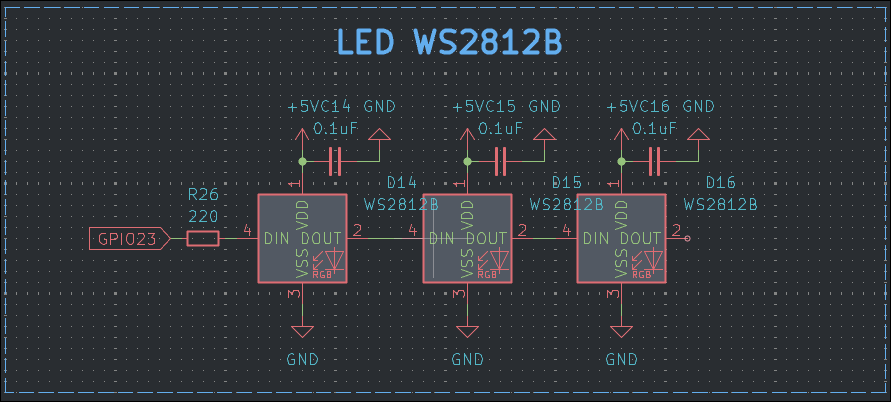
  

  
<strong>Buzzer</strong>

  

    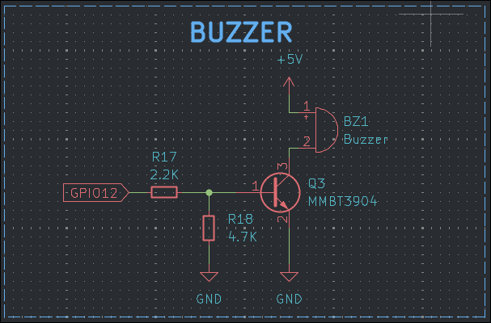
  

  
<strong>Jumper Selector</strong>

  

    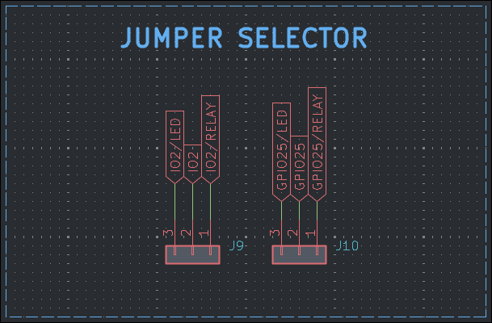
  

  
<strong>GPIO - UART</strong>

  

    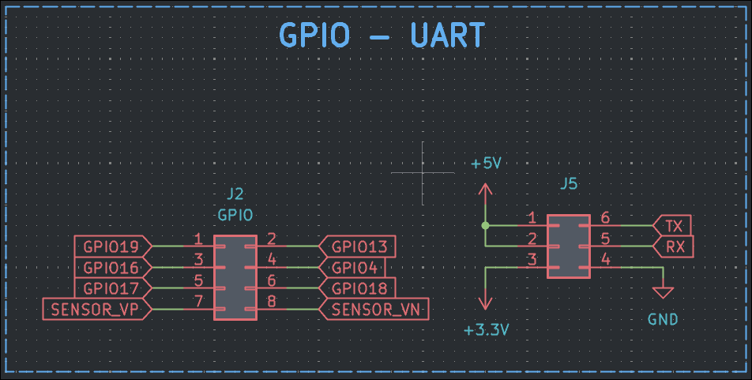
  

  
<strong>OLED I2C</strong>

  

    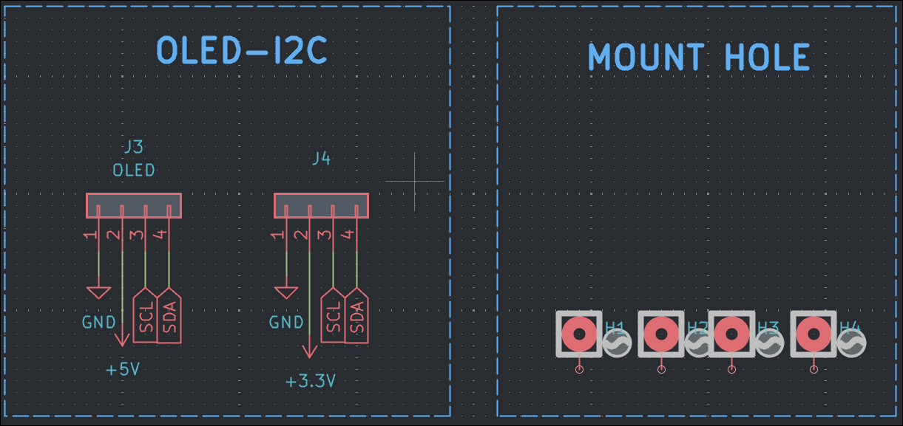
  

  
<strong>Rele</strong>

  

    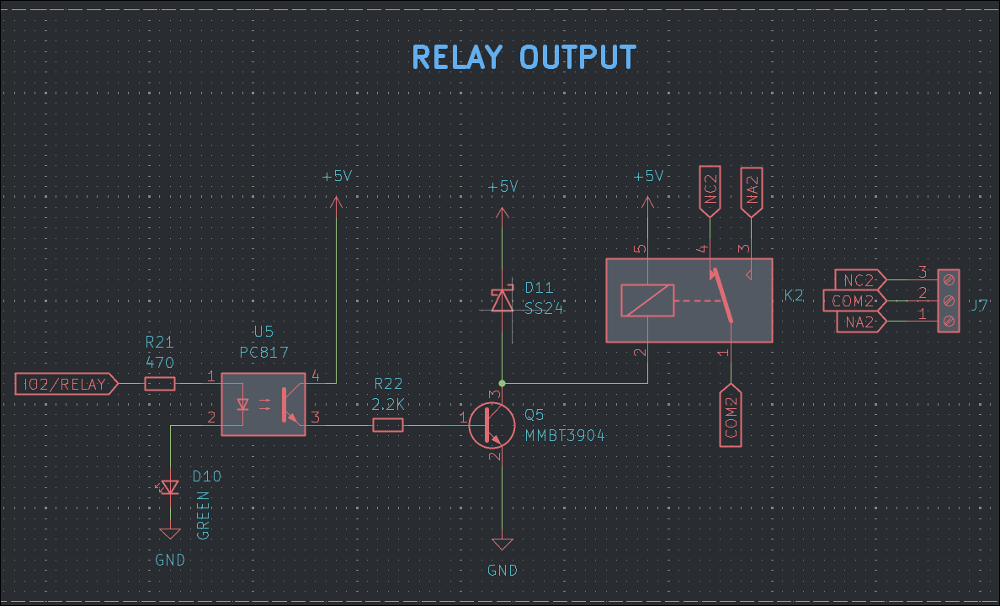
  

<b>🔌 Diseño del PCB </b>

Diseño de la PCB en dos caras, se puede descargar los archivos para su modificación o su estudio en aca [Descargar archivos del  PCB](Development_Board_ESP32-V1.0/)

  
<strong>Diseño 3D</strong>

  

    
  

  
<strong>Capa TOP</strong>

  

    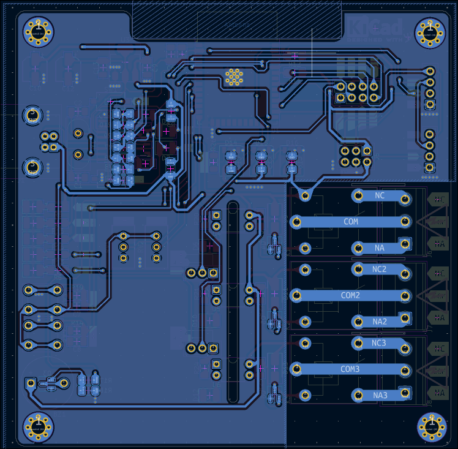
  

  
<strong>Capa BUTTON</strong>

  

    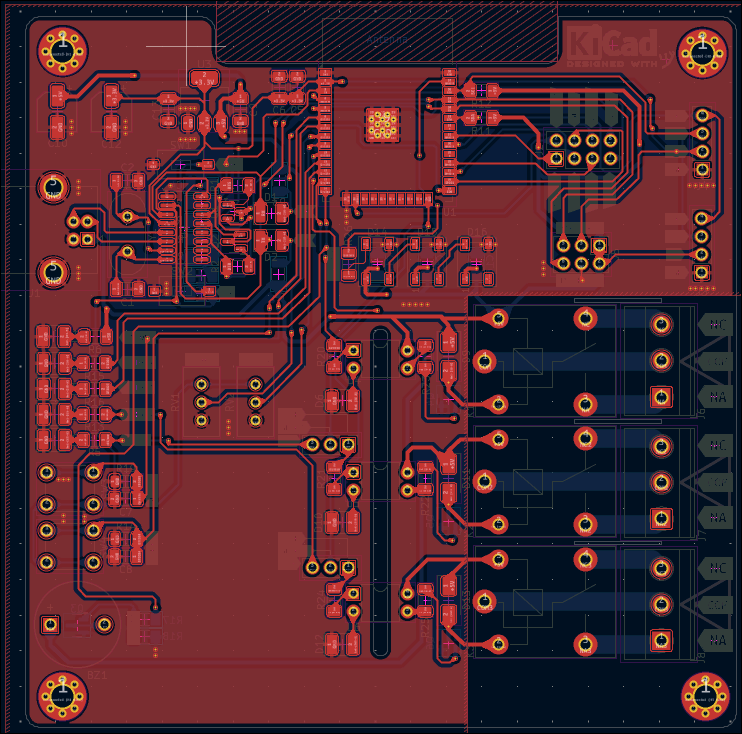
  

  
<strong>Serigrafía</strong>

  

    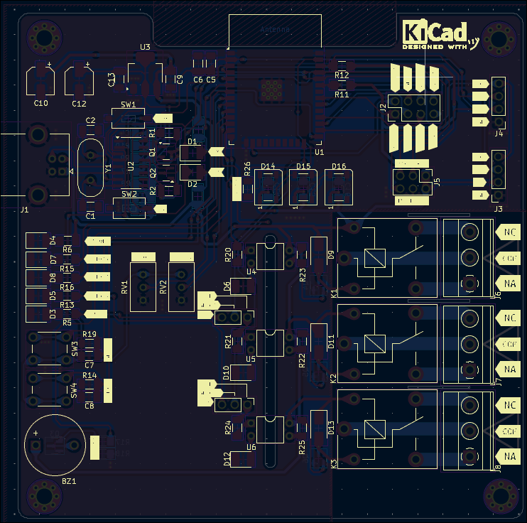
  

<b>🖥️ Introducción a KiCad</b>

KiCad es una suite de software libre para el diseño de circuitos electrónicos y la creación de placas de circuito impreso (PCB). Desarrollado originalmente por Jean-Pierre Charras y mantenido actualmente por la comunidad y la Fundación KiCad, es una herramienta poderosa y versátil que compite con soluciones comerciales en la industria electrónica.

[KiCad](https://www.kicad.org/) permite a los diseñadores electrónicos trabajar de forma integral en todo el flujo de desarrollo de hardware, desde la creación de esquemáticos eléctricos hasta la generación de archivos Gerber listos para fabricación. Entre sus principales características destacan:

✏️ Editor de esquemáticos intuitivo, con bibliotecas extensas de componentes.

🧩 Gestor de huellas (footprints) que vincula componentes con sus representaciones físicas en el PCB.

🖨️ Editor de PCB con reglas de diseño personalizables y soporte para múltiples capas.

📷 Visualizador 3D para inspeccionar el diseño de la placa antes de fabricarla.

🔁 Integración con herramientas externas para simulación eléctrica (SPICE) o gestión de proyectos.

Al ser de código abierto y multiplataforma (disponible en Windows, Linux y macOS), KiCad es una opción ideal tanto para estudiantes, makers, como para profesionales del diseño electrónico.

## 📺 Tutoriales KiCad

### Guía para el uso de KiCad #1

---

### Guía para el uso de KiCad #2

[🔙 Volver al Temario](#-temario-del-proyecto)

## 🧪 Proyectos Demostrativos

Con el objetivo de validar y demostrar la versatilidad de la placa entrenadora basada en el ESP32-WROOM-32, se desarrollaron cinco proyectos demostrativos que abarcan desde aplicaciones básicas hasta implementaciones más avanzadas. Estos proyectos fueron diseñados para cubrir distintos niveles de complejidad, permitiendo así ilustrar de manera progresiva el potencial de la placa tanto en el ámbito educativo como en entornos de prototipado profesional.

Cada proyecto está enfocado en destacar una o varias funcionalidades integradas de la placa, como el uso de salidas digitales con visualización por LEDs, entradas analógicas controladas por potenciómetros, manejo de salidas de alto voltaje mediante relés, así como el uso de interfaces de comunicación como UART, I2C o SPI.

<b>🔌💡 Proyecto 1 </b>

Este proyecto de Arduino define clases LED y PWM para controlar un LED. La clase LED permite inicializar un pin como salida digital o PWM, encenderlo, apagarlo, hacerlo parpadear y controlar su intensidad mediante PWM. La clase PWM facilita la lectura de un pin analógico y la obtención de valores raw, mapeados (0-255) y de voltaje. En el setup, se inicializa un LED (conectado al pin 2) en modo PWM. En el loop, la intensidad de este LED se controla continuamente leyendo un valor analógico a través de un objeto PWM (asociado al pin 32).

<b>🔌💡 Proyecto 2 </b>

<b>🔌💡 Proyecto 3 </b>

<b>🔌💡 Proyecto 4 </b>

<b>🔌💡 Proyecto 5 </b>

[🔙 Volver al Temario](#-temario-del-proyecto)

